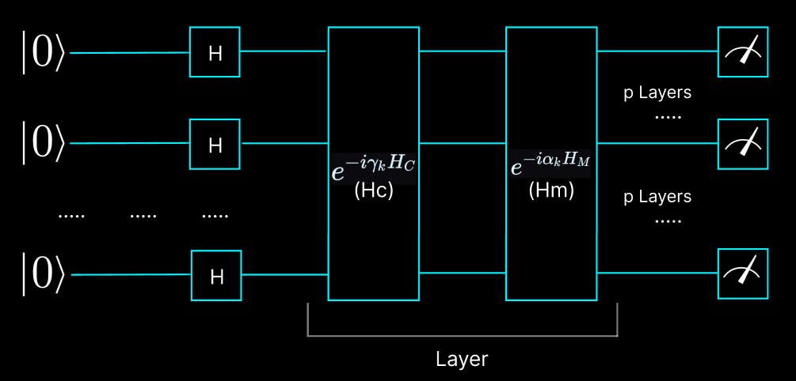

# QAOA for MaxCut – Code Walkthrough

This document explains the implementation of the Quantum Approximate Optimization Algorithm (QAOA) for solving the MaxCut problem using PennyLane. The explanation follows the structure of the code, with concise descriptions and relevant mathematical background.

---

## 1. Graph Generation

```python
num_wires = random.randint(3, 6)
wires = range(num_wires)
edges = []

for i in range(num_wires):
    possible = [j for j in range(num_wires) if j != i]
    j = random.choice(possible)
    edges.append(tuple(sorted((i, j))))

for i in range(num_wires):
    for j in range(i + 1, num_wires):
        if random.random() < 0.3:
            edges.append((i, j))

graph = nx.Graph()
graph.add_nodes_from(wires)
graph.add_edges_from(edges)
```
A graph with 3 to 6 nodes is randomly generated. Each node is connected to at least one other node, and additional edges are added probabilistically.

The **MaxCut problem** aims to partition the nodes into two sets such that the number of edges between the sets is maximized.

---

## 2. Cost and Mixer Hamiltonians

```python
cost_h, mixer_h = qml.qaoa.maxcut(graph)
```
PennyLane provides utility functions to generate:

- **Cost Hamiltonian** $$H_C$$, which encodes the MaxCut objective:
$$
H_C = \sum_{(i,j)\in E} \frac{1}{2}(Z_i Z_j - I)
$$

Where:
- $$Z_i$$ is the **Pauli-Z** operator acting on qubit i.
- $${(i,j)\in E}$$ means the edge connects nodes i and j.
- $$I$$ is identity operator with eigenvalue of 1.
- $$\frac{1}{2}$$ is a rescaling factor, used to make each term contribute 0 or 1 depending on whether the edge is cut.

Each term in $$H_C$$ contributes:
- **0** if qubits i and j are in the **same group** (both 0 or both 1)
- **-1** if they are in **opposite groups** — meaning the edge is **cut**

So the **expected value** of $$H_C$$, given a quantum state, represents the **total number of edges cut** by that state's bitstring.


- **Mixer Hamiltonian** $$H_M$$, which drives transitions between basis states:
$$
H_M = \sum_{i\in nodes} X_i
$$

Where:
- $$X_i$$ is Pauli-X operator acting on qubit i.
- This allows the quantum state to **move across the solution landscape**, rather than being stuck in one configuration.

Together with the cost unitary, it enables **constructive interference** toward better solutions and **destructive interference** against poor ones.

---

## 3. QAOA Layer

```python
def qaoa_layer(gamma, alpha):
    qml.qaoa.cost_layer(gamma, cost_h)
    qml.qaoa.mixer_layer(alpha, mixer_h)
```
Each QAOA layer applies the unitaries with adjustable parameters based on the cost and mixer Hamiltonians:

$$
U(\gamma, \alpha) = e^{-i \alpha H_M} e^{-i \gamma H_C}
$$

These layers are applied $$p$$ times (depth of the algorithm).

---

## 4. Quantum Circuit

```python
    def circuit(params):
        for w in wires:
            qml.Hadamard(wires=w)
        for gamma, alpha in params:
            qaoa_layer(gamma, alpha)
```


Applies Hadamard gates to all qubits to prepare the initial state:

$$
|\psi_0\rangle = \frac{1}{\sqrt{2^n}} \sum_{z \in \{0,1\}^n} |z\rangle
$$

The system begins in an equal superposition over all bitstrings.

The core quantum state prepared by QAOA is defined as:
$$
|\psi(\boldsymbol{\gamma}, \boldsymbol{\alpha})\rangle = \prod_{k=1}^{p} e^{-i \alpha_k H_M} e^{-i \gamma_k H_C} |+\rangle^{\otimes n}
$$

Where:
- $$\prod_{k=1}^{p}$$ ordered application of QAOA layers from $$𝑘 = 1$$ to $$p$$
- $$p$$ is the number of QAOA layers.
- $$H_C$$ is the cost hamiltonian.
- $$H_M$$ is the mixer hamiltonian.
- $$\gamma_k, \alpha_k$$ are layer-specific variational parameters which we need to optimize using classical optimizer to minimize the expectation value of the cost Hamiltonian.
- $$|+\rangle^{\otimes n}$$ represents the equal superposition state over $$n$$ qubits.


---

## 5. Cost Function and Optimization

```python
opt = qml.AdagradOptimizer(stepsize=0.5)
params = np.array([[0.5, 0.5]] * p, requires_grad=True)
```
The classical **Adagrad optimizer** is used to minimize the expected cost:

```python
@qml.qnode(dev)
def cost_function(params):
    circuit(params)
    return qml.expval(cost_h)
```

The goal is to minimize:
$$
\langle \psi(\gamma, \alpha) | H_C | \psi(\gamma, \alpha) \rangle
$$

Where $$|\psi(\gamma, \alpha)\rangle$$ is the state after applying $$p$$ layers.

---

## 6. Optimization Loop

```python
steps = 30
for i in range(steps):
    params = opt.step(cost_function, params)
    cost_val = cost_function(params)
```
The optimizer updates the parameters $$\gamma_k, \alpha_k$$ for each layer to find the minimum expectation value of the cost hamiltonian.

---

## 7. Sampling the Optimized Circuit

```python
@qml.qnode(dev)
def sample_output(params):
    circuit(params)
    return [qml.sample(qml.PauliZ(w)) for w in wires]

bitstrings_raw = sample_output(params, shots=1000)
```
After the parameters are optimized, we execute the circuit 1000 times using the final parameter values to obtain bitstrings. Each execution performs projective measurements in the Pauli-Z basis on all qubits, returning results of -1 or +1 for each wire (qubit).

The output (bitstrings_raw) is a huge array with 1000 columns and n_qubit rows.

---

## 8. Bitstring Conversion and Counting

```python
bitstrings_transposed = np.transpose(bitstrings_raw)

for sample in bitstrings_transposed:
    bitstring = "".join([str(int((1 - s) / 2)) for s in sample])
```
At first, we transpose the raw bitstring array. Now each row represents one complete bitstring.

Pauli-Z measurements return -1 or 1. The for-loop maps the values to binary:

- +1 $$\rightarrow$$ 0
- -1 $$\rightarrow$$ 1

Most frequently measured bitstring is interpreted as the **MaxCut solution**.

---

## 9. Visualization

```python
node_colors = ['gold' if bit == 0 else 'lightblue' for bit in coloring]
```
Nodes are colored according to their partition in the MaxCut.

---

## Summary

- **Quantum part** prepares and evolves a superposition over solutions using QAOA layers, and approximates the lowest energy state of the cost Hamiltonian by evaluating the expectation value of the cost Hamiltonian on the final state.
- **Classical part** optimizes parameters to minimize the cost Hamiltonian.
- **Result**: The most probable bitstring corresponds to the approximate solution to MaxCut.

---


