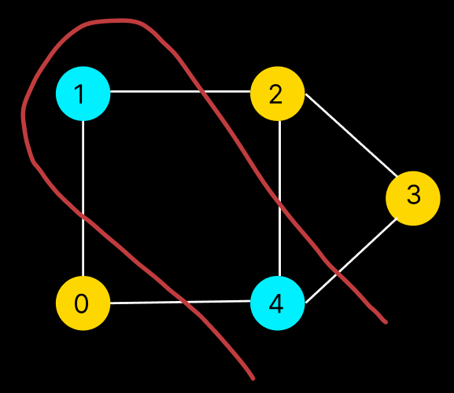

# What is QAOA?

The Quantum Approximate Optimization Algorithm (QAOA) is a hybrid quantum-classical algorithm designed to solve combinatorial optimization problems such as MaxCut.

QAOA works by preparing a parameterized quantum state using alternating layers of quantum gates based on two Hamiltonians:

- A cost Hamiltonian that encodes the objective function.

- A mixer Hamiltonian that enables transitions between solutions.

The parameters are optimized using a classical algorithm to minimize the expectation value of the cost Hamiltonian. The final quantum state is measured, and the most frequently observed bitstring approximates the optimal solution.

QAOA is particularly useful for problems where classical solutions are hard to compute but can be encoded efficiently into quantum circuits. We’ll explore the underlying logic more deeply in the code example later on.

# Introduction to MaxCut Problem

The **MaxCut problem** is a classical graph optimization problem. Given a graph with a set of nodes (vertices) and edges (connections between nodes), the goal is to divide the nodes into two groups such that the number of edges between the groups is as large as possible.

In other words, we want to "cut" the graph in a way that maximizes the number of edges crossing between the two sides.

This problem is known to be **NP-hard**, meaning it becomes very difficult to solve exactly as the size of the graph increases. However, it has many applications in fields like physics, circuit design, and network analysis — which is why approximate quantum algorithms like QAOA are valuable tools for tackling it.

---

## Visual Example

Let's consider the graph shown below:

In this example:

- The nodes are colored into **two groups**:
  - **Yellow nodes**: 0, 2, 3
  - **Blue nodes**: 1, 4
- The **red curve** visually separates the two groups.

The goal is to count the number of edges that cross between the yellow and blue groups.

These **cut edges** are:
- (0,1)
- (1,2)
- (2,4)
- (3,4)
- (0,4)

There are **5 edges crossing the cut**, which means the **maximum cut value is 5**.

This illustrates what the MaxCut problem is all about: **finding the best way to separate the graph into two groups** so that the number of crossing edges is maximized.

---

Now we will show how the **QAOA** can be used to find such a partition using quantum circuits and classical optimization.

To proceed, click "Run QAOA" to execute the algorithm and observe its performance on a randomly generated graph.

